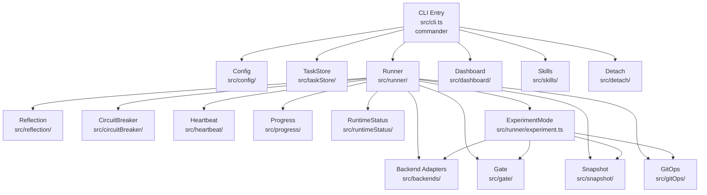
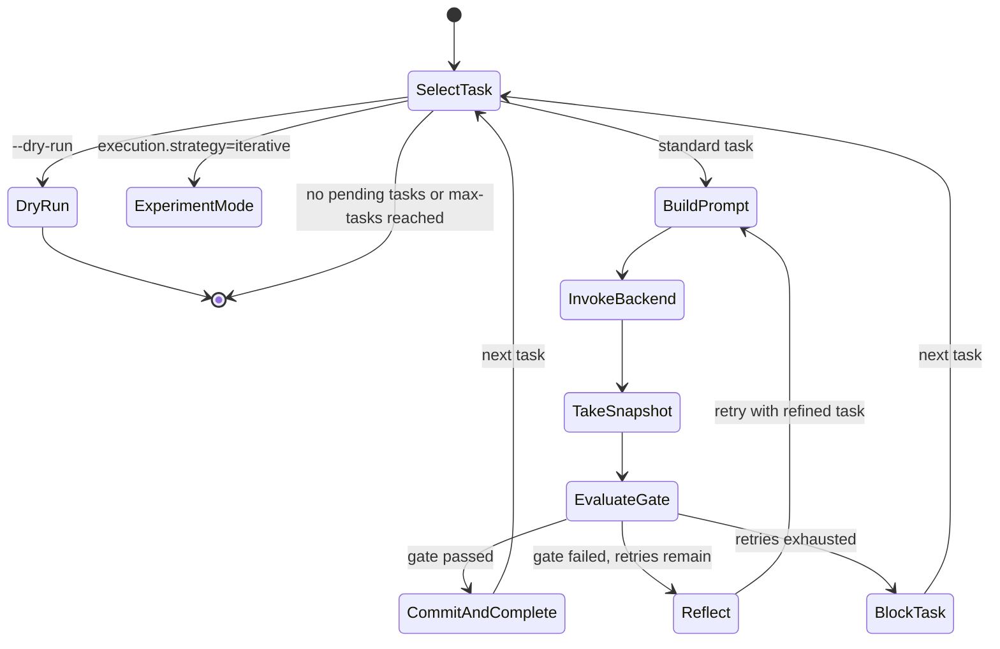
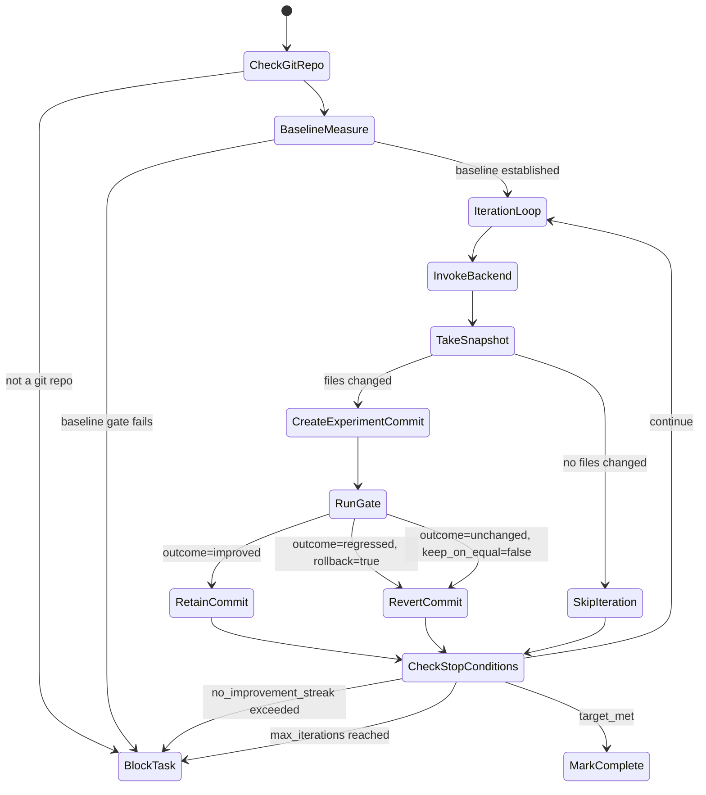
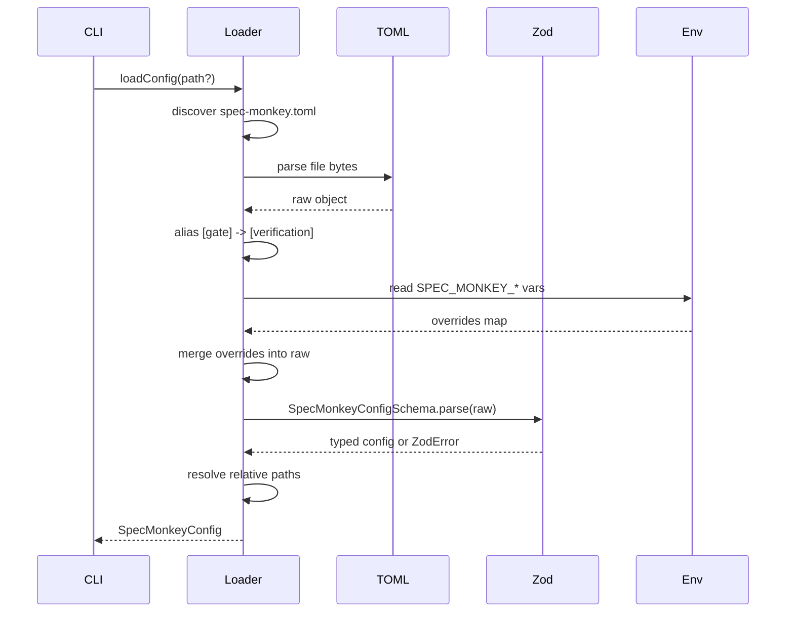

# Design Document: spec-monkey

## Overview

`spec-monkey` is a Node.js/TypeScript CLI tool for unattended AI-driven development automation — a ground-up rewrite of the Python `autodev` project. It targets Node.js 20+ with TypeScript 5+ strict mode, ESM modules, and NodeNext module resolution. The binary is named `spec-monkey` and distributed via `npm`.

The tool orchestrates a loop: select a pending task → build a prompt → invoke an AI backend subprocess → stream output → evaluate a verification gate → commit or retry. It supports four AI backends (claude, codex, gemini, opencode), experiment mode for metric-driven optimization, detached tmux sessions, a web dashboard, and a skill management system.

### Design Goals

- Zero Python runtime dependency
- Idiomatic TypeScript with strict types and zod runtime validation
- Faithful feature parity with `autodev` while improving type safety and testability
- Modular architecture where each subsystem is independently testable
- ESM-native with NodeNext resolution throughout

---

## Architecture



### Module Boundaries

Each top-level directory under `src/` is a self-contained module with a single `index.ts` barrel export. Modules communicate through typed interfaces defined in `src/types.ts`. No module imports from another module's internal files — only from its `index.ts`.

---

## Components and Interfaces

### TypeScript Project Layout

```
spec-monkey/
├── package.json
├── tsconfig.json
├── src/
│   ├── cli.ts                  # commander entry point
│   ├── types.ts                # shared type definitions
│   ├── errors.ts               # typed error classes
│   ├── config/
│   │   ├── index.ts
│   │   ├── schema.ts           # zod schemas for spec-monkey.toml
│   │   └── loader.ts           # TOML parse + env override + validation
│   ├── taskStore/
│   │   ├── index.ts
│   │   ├── schema.ts           # zod schemas for task.json
│   │   └── store.ts            # CRUD operations on task.json
│   ├── backends/
│   │   ├── index.ts
│   │   ├── types.ts            # BackendAdapter interface
│   │   ├── claude.ts
│   │   ├── codex.ts
│   │   ├── gemini.ts
│   │   ├── opencode.ts
│   │   └── executor.ts         # spawn + tee streaming
│   ├── gate/
│   │   ├── index.ts
│   │   └── gate.ts
│   ├── runner/
│   │   ├── index.ts
│   │   ├── runner.ts           # main automation loop
│   │   ├── experiment.ts       # ExperimentMode loop
│   │   └── prompt.ts           # prompt rendering
│   ├── reflection/
│   │   ├── index.ts
│   │   └── reflection.ts
│   ├── snapshot/
│   │   ├── index.ts
│   │   └── snapshot.ts
│   ├── gitOps/
│   │   ├── index.ts
│   │   └── gitOps.ts
│   ├── circuitBreaker/
│   │   ├── index.ts
│   │   └── circuitBreaker.ts
│   ├── heartbeat/
│   │   ├── index.ts
│   │   └── heartbeat.ts
│   ├── progress/
│   │   ├── index.ts
│   │   └── progress.ts
│   ├── runtimeStatus/
│   │   ├── index.ts
│   │   └── runtimeStatus.ts
│   ├── skills/
│   │   ├── index.ts
│   │   └── skills.ts
│   ├── detach/
│   │   ├── index.ts
│   │   └── detach.ts
│   ├── dashboard/
│   │   ├── index.ts
│   │   └── server.ts
│   └── init/
│       ├── index.ts
│       └── init.ts
├── test/
│   ├── config.test.ts
│   ├── taskStore.test.ts
│   ├── gate.test.ts
│   ├── snapshot.test.ts
│   ├── gitOps.test.ts
│   ├── circuitBreaker.test.ts
│   └── runner.test.ts
└── dist/                       # compiled ESM output
```

### CLI Entry Point (`src/cli.ts`)

Uses `commander` to register all subcommands. Each subcommand handler loads config (when required), then delegates to the appropriate module. The global `-c/--config` flag is registered on the root program and passed down.

```typescript
program
  .command('run')
  .option('--dry-run')
  .option('--backend <name>')
  .option('--max-tasks <n>', undefined, parseInt)
  .option('--epochs <n>', undefined, parseInt)
  .option('--detach')
  .action(async (opts) => {
    const config = await loadConfig(globalOpts.config);
    await runCommand(config, opts);
  });
```

### Backend Adapter Interface

All four backends implement a common `BackendAdapter` interface. A registry maps backend names to adapter factories.

```typescript
export interface BackendAdapter {
  readonly name: string;
  buildCommand(prompt: string, config: SpecMonkeyConfig, opts?: BuildCommandOpts): CommandSpec;
  buildPlanCommand(prompt: string, config: SpecMonkeyConfig): CommandSpec;
}

export interface CommandSpec {
  cmd: string[];
  env?: Record<string, string>;
  cwd: string;
}

export interface BackendResult {
  exitCode: number;
  logFile: string;
  teeExit: number;
}
```

The `executor.ts` module handles `child_process.spawn` with stdout/stderr merged, streaming to attempt log + main log + process stdout simultaneously.

### Runner State Machine

The runner operates as a sequential state machine per task:



### Experiment Mode Loop



---

## Data Models

All models are defined as zod schemas in their respective `schema.ts` files and exported as both the zod schema and the inferred TypeScript type.

### Config (`src/config/schema.ts`)

```typescript
export const SpecMonkeyConfigSchema = z.object({
  project: z.object({
    name: z.string().default('Untitled Project'),
    code_dir: z.string().default('.'),
    config_dir: z.string().default('.'),
  }).default({}),
  backend: z.object({
    default: z.enum(['claude', 'codex', 'gemini', 'opencode']).default('claude'),
    claude: z.object({
      skip_permissions: z.boolean().default(true),
      permission_mode: z.enum(['bypassPermissions', 'dontAsk', 'default']).default('bypassPermissions'),
      output_format: z.enum(['text', 'json', 'stream-json']).default('stream-json'),
      model: z.string().default(''),
    }).default({}),
    codex: z.object({
      model: z.string().default(''),
      yolo: z.boolean().default(true),
      full_auto: z.boolean().default(false),
      dangerously_bypass_approvals_and_sandbox: z.boolean().default(true),
    }).default({}),
    gemini: z.object({
      model: z.string().default(''),
      yolo: z.boolean().default(true),
      output_format: z.enum(['text', 'json']).default('text'),
    }).default({}),
    opencode: z.object({
      model: z.string().default(''),
      permissions: z.string().default('{"read":"allow","edit":"allow","bash":"allow","glob":"allow","grep":"allow"}'),
    }).default({}),
  }).default({}),
  run: z.object({
    max_retries: z.number().int().default(3),
    max_tasks: z.number().int().default(999),
    max_epochs: z.number().int().default(1),
    heartbeat_interval: z.number().int().default(20),
    keep_attempt_logs: z.boolean().default(true),
    reset_tasks_on_start: z.boolean().default(false),
    delay_between_tasks: z.number().int().default(2),
  }).default({}),
  files: z.object({
    task_json: z.string().default('task.json'),
    progress: z.string().default('progress.txt'),
    execution_guide: z.string().default('AGENT.md'),
    task_brief: z.string().default('TASK.md'),
    log_dir: z.string().default('logs'),
    attempt_log_subdir: z.string().default('attempts'),
  }).default({}),
  verification: z.object({
    min_changed_files: z.number().int().default(1),
    changed_files_preview_limit: z.number().int().default(20),
    validate_commands: z.array(z.string()).default([]),
    validate_timeout_seconds: z.number().int().default(1800),
    validate_working_directory: z.string().default(''),
    validate_environment: z.record(z.string()).default({}),
  }).default({}),
  reflection: z.object({
    enabled: z.boolean().default(true),
    max_refinements_per_task: z.number().int().default(3),
    prompt_timeout_seconds: z.number().int().default(180),
    log_tail_lines: z.number().int().default(80),
    max_attempt_history_entries: z.number().int().default(12),
    max_learning_notes: z.number().int().default(20),
    max_project_learning_entries: z.number().int().default(50),
    prompt_learning_limit: z.number().int().default(6),
  }).default({}),
  snapshot: z.object({
    watch_dirs: z.array(z.string()).default(['.']),
    ignore_dirs: z.array(z.string()).default(['.git', 'node_modules', 'logs', '__pycache__', 'build', 'venv']),
    ignore_path_globs: z.array(z.string()).default(['build-*', 'cmake-build-*', '*.o', '*.obj', 'task.json', 'progress.txt']),
    include_path_globs: z.array(z.string()).default([]),
  }).default({}),
  circuit_breaker: z.object({
    no_progress_threshold: z.number().int().default(3),
    repeated_error_threshold: z.number().int().default(3),
    rate_limit_cooldown: z.number().int().default(300),
    rate_limit_patterns: z.array(z.string()).default(['rate_limit', 'rate limit', 'overloaded', 'too many requests', 'usage cap', 'throttl']),
  }).default({}),
  git: z.object({
    auto_commit: z.boolean().default(true),
    commit_message_template: z.string().default('spec-monkey: {task_id} - {task_name}'),
  }).default({}),
  detach: z.object({
    tmux_session_prefix: z.string().default('spec-monkey'),
  }).default({}),
});

export type SpecMonkeyConfig = z.infer<typeof SpecMonkeyConfigSchema>;
```

### Task (`src/taskStore/schema.ts`)

```typescript
export const TaskSchema = z.object({
  id: z.string().min(1),
  title: z.string().min(1),
  description: z.string().min(1),
  steps: z.array(z.string()).min(1),
  completion: z.object({
    kind: z.enum(['boolean', 'numeric']).default('boolean'),
    name: z.string().optional(),
    source: z.string().optional(),
    json_path: z.string().optional(),
    direction: z.enum(['higher_is_better', 'lower_is_better']).optional(),
    min_improvement: z.number().optional(),
    unchanged_tolerance: z.number().optional(),
    target: z.number().optional(),
    success_when: z.string().optional(),
  }).default({}),
  execution: z.object({
    strategy: z.enum(['standard', 'iterative']).default('standard'),
    max_iterations: z.number().int().default(1),
    rollback_on_failure: z.boolean().default(true),
    keep_on_equal: z.boolean().default(false),
    stop_after_no_improvement: z.number().int().optional(),
    commit_prefix: z.string().default('experiment'),
  }).default({}),
  verification: z.object({
    path_patterns: z.array(z.string()).optional(),
    validate_commands: z.array(z.string()).optional(),
    validate_timeout_seconds: z.number().int().optional(),
    validate_working_directory: z.string().optional(),
    validate_environment: z.record(z.string()).optional(),
  }).optional(),
  docs: z.array(z.string()).optional(),
  implementation_notes: z.string().optional(),
  passes: z.boolean().default(false),
  blocked: z.boolean().default(false),
  block_reason: z.string().default(''),
  blocked_at: z.string().optional(),
  completed_at: z.string().optional(),
  attempt_history: z.array(z.unknown()).default([]),
  learning_notes: z.array(z.string()).default([]),
});

export const TaskStoreSchema = z.object({
  tasks: z.array(TaskSchema),
  learning_journal: z.array(z.unknown()).default([]),
  planning_source: z.string().optional(),
});

export type Task = z.infer<typeof TaskSchema>;
export type TaskStore = z.infer<typeof TaskStoreSchema>;
```

### Gate Result

```typescript
export interface GateCheck { name: string; ok: boolean; details: string; }

export type MetricOutcome = 'improved' | 'unchanged' | 'regressed' | 'measured' | 'invalid' | 'target_met' | 'baseline';

export interface GateMetricResult {
  name: string;
  value: number | null;
  baseline: number | null;
  bestBefore: number | null;
  outcome: MetricOutcome;
  details: string;
}

export interface GateResult {
  status: 'passed' | 'failed';
  taskId: string;
  checks: GateCheck[];
  errors: string[];
  warnings: string[];
  metric: GateMetricResult | null;
  completionResult: {
    kind: 'boolean' | 'numeric';
    passed: boolean;
    outcome: string;
    details: string;
  };
}
```

### Snapshot

```typescript
// Map of relative path -> [mtime_ns as bigint, size_bytes]
export type SnapshotEntry = [bigint, number];
export type Snapshot = Map<string, SnapshotEntry>;
```

### RuntimeStatus

```typescript
export interface RuntimeStatus {
  status: 'idle' | 'running' | 'validating' | 'complete' | 'error';
  lastUpdated: string;
  currentTaskId: string;
  currentTaskTitle: string;
  currentAttempt: number;
  maxAttempts: number;
  taskCounts: { pending: number; completed: number; blocked: number; running: number };
  heartbeatElapsedSeconds: number;
  attemptLog: string;
}
```

### ExperimentLogEntry

```typescript
export interface ExperimentLogEntry {
  taskId: string;
  iteration: number;
  metricName: string;
  baselineValue: number | null;
  bestBefore: number | null;
  measuredValue: number | null;
  outcome: string;
  commitSha: string;
  revertedSha: string;
  timestamp: string;
  notes?: string;
}
```

---

## Config Loading Flow



Environment variable override uses the pattern `SPEC_MONKEY_<SECTION>_<KEY>` (e.g. `SPEC_MONKEY_BACKEND_DEFAULT=gemini`). The loader iterates all zod schema keys and checks for matching env vars, coercing strings to the declared type (boolean: `"true"/"1"`, number: `parseInt`/`parseFloat`).

---

## Backend Adapter Pattern

Each backend module exports a factory function returning a `BackendAdapter`. The registry in `src/backends/index.ts` maps names to adapters:

```typescript
const REGISTRY: Record<string, BackendAdapter> = {
  claude: claudeAdapter,
  codex: codexAdapter,
  gemini: geminiAdapter,
  opencode: openCodeAdapter,
};

export function getBackend(name: string): BackendAdapter {
  const adapter = REGISTRY[name];
  if (!adapter) throw new RuntimeError(`Unknown backend: ${name}`);
  return adapter;
}
```

The `executor.ts` module handles the actual subprocess lifecycle using `child_process.spawn` with stdout and stderr merged into a single stream, teed to the attempt log file, the main log file, and `process.stdout` simultaneously.

---

## Error Handling Strategy

### Typed Error Classes (`src/errors.ts`)

```typescript
export class ConfigError extends Error {
  constructor(msg: string) { super(msg); this.name = 'ConfigError'; }
}
export class RuntimeError extends Error {
  constructor(msg: string) { super(msg); this.name = 'RuntimeError'; }
}
export class TaskAuditError extends Error {
  constructor(msg: string, public readonly issues: string[]) {
    super(msg); this.name = 'TaskAuditError';
  }
}
export class BackendNotFoundError extends Error {
  constructor(binary: string) {
    super(`Backend binary not found: ${binary}. Ensure it is installed and in PATH.`);
    this.name = 'BackendNotFoundError';
  }
}
```

### Error Propagation Rules

- `ConfigError`: thrown by config loader, caught at CLI top level, prints message and exits 1
- `RuntimeError`: thrown by backends and planning, caught at command handler level
- `TaskAuditError`: thrown by task store validation, caught at planning and init
- Unhandled `Error`: caught by top-level `process.on('uncaughtException')`, prints stack and exits 1
- SIGINT (exit code 130): detected via `process.on('SIGINT')` and backend exit code 130; runner stops cleanly
- Environment errors: detected by scanning attempt log for halt patterns; runner stops without blocking task

### Shell Injection Prevention

Validation commands are parsed using a safe argv splitter (e.g. the `shell-quote` npm package or a minimal shlex port). Any token containing `&&`, `||`, `|`, `;`, `<`, `>`, `$(`, or backtick causes a `RuntimeError` before execution. Commands are always passed as `string[]` to `child_process.spawn` — never to a shell.


---

## Correctness Properties

*A property is a characteristic or behavior that should hold true across all valid executions of a system — essentially, a formal statement about what the system should do. Properties serve as the bridge between human-readable specifications and machine-verifiable correctness guarantees.*

### Property 1: Config round-trip

*For any* valid `spec-monkey.toml` file, parsing it into a `SpecMonkeyConfig` object, serializing that object back to TOML, and parsing again should produce a config object that is deeply equal to the first parse result.

**Validates: Requirements 2.1, 2.7**

---

### Property 2: Config defaults for absent keys

*For any* subset of config keys present in a `spec-monkey.toml`, parsing it should produce a `SpecMonkeyConfig` where every absent key has its documented default value (as defined in the zod schema).

**Validates: Requirements 2.2**

---

### Property 3: Environment variable override

*For any* config field reachable via `SPEC_MONKEY_<SECTION>_<KEY>` and any valid string value for that field, setting the env var before loading config should produce a `SpecMonkeyConfig` where that field equals the coerced env var value, regardless of what the TOML file contains.

**Validates: Requirements 2.3**

---

### Property 4: Invalid backend name throws ConfigError

*For any* string that is not one of `claude`, `codex`, `gemini`, `opencode`, setting it as `backend.default` in the config should cause `loadConfig` to throw a `ConfigError`.

**Validates: Requirements 2.4**

---

### Property 5: Relative paths are resolved against config directory

*For any* relative path string in the `[files]` or `[project]` sections of `spec-monkey.toml`, the resolved path in the loaded config should be absolute and should be a child of the directory containing the `spec-monkey.toml` file.

**Validates: Requirements 2.5**

---

### Property 6: Backend command building correctness

*For any* backend name in `{claude, codex, gemini, opencode}` and any valid config for that backend, `buildCommand` should produce a `CommandSpec` whose `cmd[0]` is the expected binary name and whose flags include all required non-interactive/auto-approve flags as specified for that backend.

**Validates: Requirements 3.1, 3.2, 3.3, 3.4**

---

### Property 7: Plan command differs from standard command

*For any* backend and config, `buildPlanCommand` should produce a `CommandSpec` that captures stdout as text (i.e. is a one-shot invocation) and does not start an interactive session, while `buildCommand` produces the standard interactive-capable invocation.

**Validates: Requirements 3.6**

---

### Property 8: Task store defaults for absent fields

*For any* task object in `task.json` that is missing optional fields (`passes`, `blocked`, `block_reason`, `attempt_history`, `learning_notes`), loading the task store should produce a `Task` where those fields have their documented defaults (`false`, `false`, `""`, `[]`, `[]`).

**Validates: Requirements 4.1**

---

### Property 9: Task store validation rejects incomplete tasks

*For any* task object missing one or more of `id`, `title`, `description`, or `steps` (or with an empty `steps` array), the task store schema validation should reject it with a descriptive error rather than accepting it.

**Validates: Requirements 4.9**

---

### Property 10: Task reset only affects targeted tasks

*For any* task store state and any reset operation (reset by IDs, reset all non-completed, or retry blocked), only the tasks matching the operation's target criteria should change state; all other tasks should remain unchanged.

**Validates: Requirements 4.4, 4.5, 4.6**

---

### Property 11: Task block sets required fields

*For any* task ID and block reason string, calling `blockTask(id, reason)` on the task store should produce a task where `blocked = true`, `block_reason` equals the provided reason, and `blocked_at` is a valid ISO 8601 UTC timestamp.

**Validates: Requirements 4.7**

---

### Property 12: Task completion sets required fields

*For any* task, calling `markTaskPassed(id)` should produce a task where `passes = true` and `completed_at` is a valid ISO 8601 UTC timestamp.

**Validates: Requirements 4.8**

---

### Property 13: Non-JSON planner output throws RuntimeError

*For any* string that is not valid JSON, passing it as the backend output to the plan result parser should throw a `RuntimeError` that includes the first 500 characters of the raw string.

**Validates: Requirements 5.4**

---

### Property 14: Boolean gate correctness

*For any* list of changed files, list of validate commands (with their mock exit codes), and `min_changed_files` threshold, the gate result for a boolean completion task should be `passed` if and only if all validate commands exit 0 and the changed file count meets the minimum.

**Validates: Requirements 7.1**

---

### Property 15: Metric outcome classification

*For any* measured metric value, reference value (best-so-far or baseline), direction (`higher_is_better` or `lower_is_better`), `min_improvement`, and `unchanged_tolerance`, the gate's metric outcome should be exactly one of `improved`, `unchanged`, or `regressed` according to the comparison rules, and `target_met` when a target is set and met.

**Validates: Requirements 7.2, 7.3, 7.4, 7.5, 7.6**

---

### Property 16: enforceChangeRequirements=false skips file checks

*For any* task with `completion.kind = "boolean"` and any changed-file list (including empty), running the gate with `enforceChangeRequirements = false` should never produce an error related to `min_changed_files` or `path_patterns`.

**Validates: Requirements 7.7**

---

### Property 17: Shell control tokens in validate commands are rejected

*For any* validate command string containing at least one shell control token (`&&`, `||`, `|`, `;`, `<`, `>`, `$(`, or backtick), the gate should reject it with a `RuntimeError` before attempting to execute it.

**Validates: Requirements 7.8**

---

### Property 18: Reflection preserves immutable task fields

*For any* task and any reflection output object, applying reflection to the task should produce a new task where `id`, `title`, `description`, `completion`, and `execution` are byte-for-byte identical to the original task's values.

**Validates: Requirements 8.2**

---

### Property 19: Experiment log entries contain required fields

*For any* experiment iteration result, the JSONL entry appended to `logs/experiments.jsonl` should contain all of: `task_id`, `iteration`, `metric_name`, `baseline_value`, `best_before`, `measured_value`, `outcome`, `commit_sha`, `reverted_sha`, and `timestamp`.

**Validates: Requirements 9.9**

---

### Property 20: Snapshot no-op produces empty diff

*For any* directory state, taking a snapshot before and after a no-op (no files written, modified, or deleted) should produce a diff of zero entries.

**Validates: Requirements 11.6**

---

### Property 21: Snapshot respects ignore configuration

*For any* directory tree and any `ignore_dirs` or `ignore_path_globs` configuration, the snapshot should not contain any entry whose path matches an ignored directory component or glob pattern.

**Validates: Requirements 11.2, 11.3**

---

### Property 22: Circuit breaker opens at threshold

*For any* circuit breaker configuration with threshold N, recording N consecutive no-progress attempts (or N consecutive identical-exit-code failures) should cause `isTripped` to become `true`, and recording fewer than N should leave it `false`.

**Validates: Requirements 12.1, 12.2**

---

### Property 23: Progress file is append-only

*For any* sequence of progress write operations, the resulting `progress.txt` file should contain all previously written entries in their original form — no entry should be modified or deleted between writes.

**Validates: Requirements 14.4**

---

### Property 24: Non-destructive re-init

*For any* existing project directory with a `spec-monkey.toml` and tool wrapper files, running `spec-monkey init` again (with any `--use` value) should leave all pre-existing files with their original content unchanged.

**Validates: Requirements 1.4, 1.7**

---

## Error Handling

### Error Taxonomy

| Error Class | When Thrown | Exit Code |
|---|---|---|
| `ConfigError` | Invalid TOML, bad enum value, missing required field | 1 |
| `RuntimeError` | Backend failure, bad JSON from planner, shell injection | 1 |
| `TaskAuditError` | Task missing required fields, invalid completion contract | 1 |
| `BackendNotFoundError` | Binary not in PATH | 1 |
| SIGINT / exit 130 | User interrupt | 130 |
| Blocked tasks present | Run completed with blocked tasks | 2 |

### Graceful Degradation

- Git operations: if the project is not a git repo, all git operations return a no-op result silently. If `.git/index.lock` exists, log a warning and return no-op.
- Dashboard: if the optional web dependency is absent, print an install hint and exit 1.
- tmux: if not installed, print a clear error and exit 1.
- `task.json` missing: `spec-monkey status` prints a helpful message and exits 0; `spec-monkey run` exits 1 with a suggestion to run `spec-monkey plan`.

### Environment Error Detection

The runner scans each attempt log for patterns from `env_errors.halt_patterns` (e.g. `"permission denied"`, `"invalid api key"`). When found, the runner stops immediately without marking the current task blocked, and prints remediation guidance. This prevents wasting retries on a broken environment.

---

## Testing Strategy

### Dual Testing Approach

Both unit tests and property-based tests are required and complementary:

- Unit tests catch concrete bugs with specific inputs and verify integration points
- Property tests verify universal correctness across randomized inputs

### Property-Based Testing

Use `fast-check` as the property-based testing library. Each property test must run a minimum of 100 iterations:

```typescript
import * as fc from 'fast-check';

// Feature: spec-monkey, Property 20: Snapshot no-op produces empty diff
it('snapshot no-op produces empty diff', () => {
  fc.assert(
    fc.property(fc.array(fc.string()), (files) => {
      const snap = takeSnapshot(files);
      const diff = diffSnapshots(snap, snap);
      expect(diff).toHaveLength(0);
    }),
    { numRuns: 100 }
  );
});
```

Each property test must include a comment in the format:
```
// Feature: spec-monkey, Property N: <property text>
```

Each correctness property in this document must be implemented by exactly one property-based test.

### Unit Testing

Use `vitest` for all tests. Required test files:

- `test/config.test.ts` — config loading, defaults, env overrides, path resolution, ConfigError cases
- `test/taskStore.test.ts` — schema validation, CRUD operations, task state transitions
- `test/gate.test.ts` — boolean gate, numeric metric extraction, outcome classification, shell injection rejection
- `test/snapshot.test.ts` — snapshot diff, ignore patterns, no-op idempotence
- `test/gitOps.test.ts` — commit creation, revert, readRecentGitHistory, no-op when not a git repo
- `test/circuitBreaker.test.ts` — threshold behavior, rate limit detection, trip/reset
- `test/runner.test.ts` — state machine transitions, dry-run, SIGINT handling

Unit tests focus on:
- Specific examples demonstrating correct behavior (e.g. `[gate]` alias for `[verification]`)
- Error conditions (missing `task.json`, malformed JSON, binary not found)
- Integration points (config → runner, gate → runner)
- Edge cases (empty task list, zero changed files, very large attempt logs)

### Test Configuration (`vitest.config.ts`)

```typescript
export default {
  test: {
    environment: 'node',
    coverage: { provider: 'v8', include: ['src/**/*.ts'] },
  },
};
```
